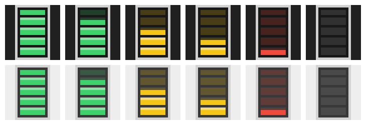

# Claude Usage Tray

A Windows tray icon that shows how much of your Claude subscription (Pro/Max) usage limit is left.

- **Icon**: a stack of segments filled by what's left of the 5-hour session window.
  Green above 50%, yellow at 21–50%, red at 20% or below, gray when there's no data or it's stale.
- **Hover**: a popup with two bars, one for the session (5 h) and one for the week, plus reset times.
- **Left click**: refresh now (at most once every 30 seconds).
- **Right click**: menu with refresh, open claude.ai/settings/usage, settings, start with Windows, exit.



## Build

Requires the .NET 8 SDK (or newer).

```powershell
cd ClaudeUsageTray
dotnet run                     # run from source

# single exe (requires the .NET 8 Desktop Runtime):
dotnet publish -c Release -r win-x64 --self-contained false -p:PublishSingleFile=true
# output: bin\Release\net8.0-windows\win-x64\publish\ClaudeUsageTray.exe
```

## Where the data comes from

The app sends a GET request to `https://api.anthropic.com/api/oauth/usage`, the same endpoint
Claude Code uses for `/usage`. **This endpoint is undocumented**: it may change or disappear
without notice. If that happens, the popup will say the API format has changed.

The token is looked up in this order:

1. `oauthToken` in `%APPDATA%\ClaudeUsageTray\settings.json`
2. the `CLAUDE_CODE_OAUTH_TOKEN` environment variable
3. Claude Code's login file: `%USERPROFILE%\.claude\.credentials.json`
   (or `%CLAUDE_CONFIG_DIR%\.credentials.json`)

The app **never refreshes the token itself**. Claude Code rotates its refresh tokens, so a
refresh from another program would log Claude Code out. As a result, if Claude Code hasn't
been run for a while, its token expires and the icon turns gray.

A more reliable option is to issue a long-lived token once:

```powershell
claude setup-token
```

and put it in `oauthToken` in settings.json (or in the `CLAUDE_CODE_OAUTH_TOKEN` variable).
The settings file stores the token in plain text, so don't share or commit it.

## Settings

`%APPDATA%\ClaudeUsageTray\settings.json` is created on first run and re-read before every
refresh, so changes apply without a restart.

| Field | Default | What it does |
|---|---|---|
| `pollIntervalMinutes` | `3` | How often to poll the server. The endpoint returns 429 on frequent requests, so don't go below 2–3 minutes. |
| `warnBelowPercent` | `50` | Remaining percentage at which the color turns yellow. |
| `criticalBelowPercent` | `20` | Remaining percentage at which the color turns red. |
| `usageUrl` | `https://api.anthropic.com/api/oauth/usage` | Endpoint address. |
| `oauthToken` | `null` | Manually supplied token (see above). |

On a 429 response the polling interval backs off exponentially (up to 30 minutes), and the last
known data stays on screen.

## Project layout

| File | Contents |
|---|---|
| `TrayController.cs` | Tray icon, polling, hover popup, menu |
| `Usage.cs` | HTTP client, response parsing, token lookup |
| `IconRenderer.cs` | Drawing the stack icon, colors |
| `UsagePopup.xaml(.cs)` | Popup with the two bars |
| `AppSettings.cs` | settings.json |
| `Native.cs` | WinAPI and autostart (HKCU\…\Run) |
